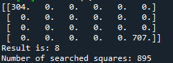

# GraphTheoryByMe
Graphs Graphs Graphs

# 1. Ford Furkenson algorithm
[fordFurksenon.py](https://github.com/Jankoetf/GraphTheoryByMe/blob/main/fordFurksenon.py)

**Example: Jobs and workers**
- One worker can do at max one job
- Every job can have at max one worker doing it
- What is a maximum number of workers that can get a job?

     

- First Iteration

     
     

- Second Iteration

     
     

On this specific example we get that maximum 2 workers can get a job.

# 2. Comparing DFS, BFS, A* on labyrinth problem
[Labyrinth.py](https://github.com/Jankoetf/GraphTheoryByMe/blob/main/lavirint.py)

-  Simulation Results:

| Labyrinth          | DFS | BFS | A*  |
|--------------------|-----|-----|-----|
| small regular      | 30  | 21  | 13 |
| small no path      | 18  | 9   |  8 |
| big many obstacles | 89  | 93  | 28 |
| small empty        | 895 | 154 |  9 |

- start is represented as 304, end with 707
-  1 means obstacle, 0 means no obstacle

    <em>Small Regular Labyrinth</em>  
    <em>Labyrinth without Path</em> 

    <em>Big Labyrint</em> 
    <em>Small empty labyrinth</em> 

# 3. Weighted graph, Djakstra algo
[GraphAlgos_Djakstra.py.py](https://github.com/Jankoetf/GraphTheoryByMe/blob/main/GraphAlgos_Djakstra.py)

    <em> Weighted Graph </em> 

# 4. Topsort, Cycle detection
[top_sort_cycle_detection.py](https://github.com/Jankoetf/GraphTheoryByMe/blob/main/top_sort_cycle_detection.py)

    <em> Directed Graph </em> 

# 5. 2 Best picks task
[top_sort_cycle_detection.py](https://github.com/Jankoetf/GraphTheoryByMe/blob/main/top_sort_cycle_detection.py)

    <em> Directed Graph </em> 

# 6. Bfs, Dfs paths, Practice problems
[bfs_dfs_path.py](https://github.com/Jankoetf/GraphTheoryByMe/blob/main/bfs_dfs_path.py)
[Graphs_practice.py](https://github.com/Jankoetf/GraphTheoryByMe/blob/main/Graphs_practice.py)

## **Thank you for exploring my Repo!** 
If you'd like to learn more about my background and qualifications, please visit my [LinkedIn profile](https://www.linkedin.com/in/jankomitrovic)
